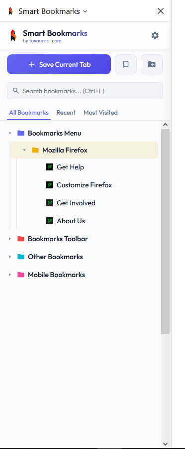
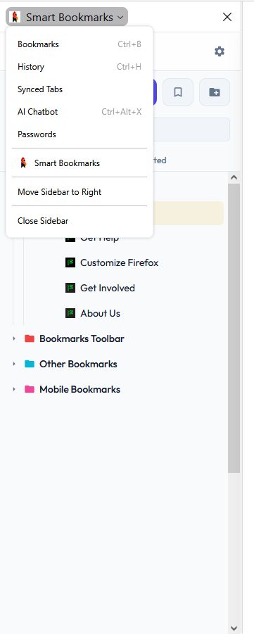
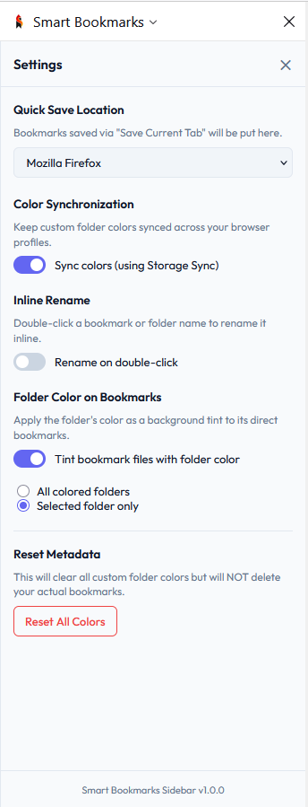
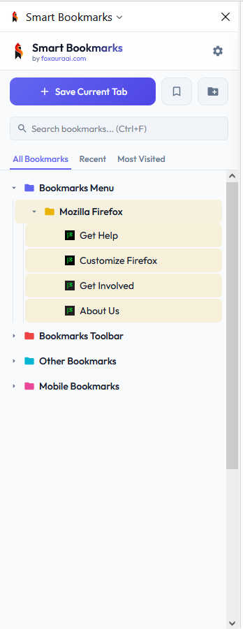
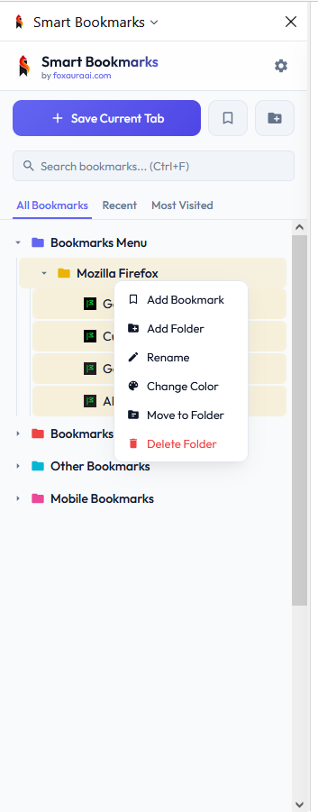
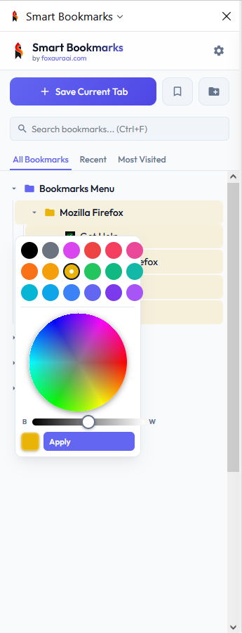

# 🔖 Smart Bookmarks Sidebar

> A smart bookmarks sidebar to color, drag and drop, rename, and save browser tabs and more, built by Foxaura AI.
> A powerful, beautiful Firefox sidebar to color, organize, search, and save your bookmarks — all in one place.

[](./LICENSE)
[](https://addons.mozilla.org/en-US/firefox/addon/smart-bookmarks-sidebar/)
[](https://foxauraai.com)

---

## ✨ Features

- 🎨 **Color folders** — assign custom colors using a full color wheel or 18-color preset palette
- 📁 **Drag & drop** — reorder and nest bookmarks and folders with precise above / below / inside drop zones
- ✏️ **Inline rename** — double-click any bookmark or folder to rename it instantly (optional, toggle in settings)
- 💾 **Quick save** — save the current tab with one click or the `Alt+A` shortcut
- 🔍 **Instant search** — search across all bookmarks with highlighted matches (`Ctrl+F`)
- 📌 **Recent & Most Visited** — dedicated tabs for your latest and most-clicked bookmarks
- 🗂️ **Move to folder** — relocate any bookmark or folder via a clean dialog
- 🎨 **Folder color tinting** — optionally tint child bookmarks with their parent folder's color
- ⚙️ **Settings panel** — configure save location, inline rename, color sync, tint mode, and more
- 🌗 **Light & dark theme** — automatically follows your system preference

---

## 📸 Screenshots

<p align="center">
  
  
  
</p>

<p align="center">
  
  
  
</p>

---

## 🚀 Installation

### From Firefox Add-ons (AMO)

Install directly from the [Firefox Add-ons page](https://addons.mozilla.org/en-US/firefox/addon/smart-bookmarks-sidebar/).

### From Source

1. Clone this repository:
   ```bash
   git clone https://github.com/foxauraai/smart-bookmarks-sidebar.git
   ```
2. Open Firefox and navigate to `about:debugging`
3. Click **This Firefox** → **Load Temporary Add-on**
4. Select the `manifest.json` file from the cloned folder

---

## 🗂️ Project Structure

```
smart-bookmarks-sidebar/
├── icons/
│   ├── icon-64.png
│   └── icon-128.png
├── background.js       # Toolbar button → sidebar toggle
├── manifest.json       # Extension manifest (MV2)
├── sidebar.html        # Sidebar UI markup
├── sidebar.css         # Styling (light + dark theme)
├── sidebar.js          # All sidebar logic
└── LICENSE
```

---

## ⌨️ Keyboard Shortcuts

| Shortcut | Action |
|---|---|
| `Ctrl+F` | Focus the search bar |
| `Alt+A` | Save the current tab |

---

## ⚙️ Settings

| Setting | Description |
|---|---|
| Quick Save Location | Choose which folder new tabs are saved to |
| Inline Rename | Enable double-click renaming of bookmarks and folders |
| Folder Color Tinting | Apply folder color as a background tint to its bookmarks |
| Tint Mode | Tint all colored folders, or only the selected one |
| Color Synchronization | Sync custom folder colors across browser profiles via storage sync |
| Reset Colors | Clear all custom folder colors (bookmarks are not affected) |

---

## 🔒 Privacy

Smart Bookmarks Sidebar collects **no data**. All bookmark data and settings are stored locally in your browser using Firefox's built-in storage APIs and never leave your device. The only external request made is to load favicons from `https://www.google.com/s2/favicons` for display purposes — no user data is transmitted.

---

## 🛠️ Built With

- Vanilla JavaScript (no frameworks, no bundler)
- Firefox WebExtensions API (`bookmarks`, `tabs`, `storage`, `activeTab`)
- [Outfit](https://fonts.google.com/specimen/Outfit) — Google Fonts

---

## 📄 License

[MIT](./LICENSE) © [Foxaura AI](https://foxauraai.com)
